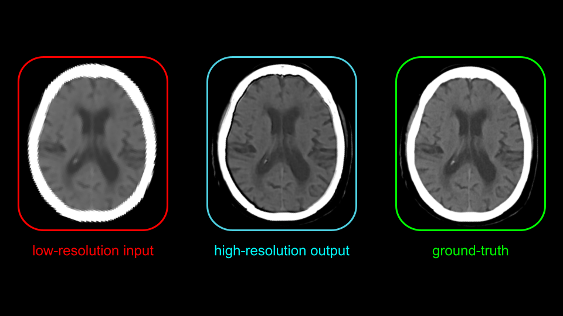

# SUPER RESOLUTION FOR MEDICAL CT SCANS

**from blurred, low-resolution slices to high-quality medical images**

## **Table of Contents**
1. [Overview](#overview)
   - [Motivation and Scenario](#motivation-and-scenario)
   - [Training Strategy](#training-strategy)
   - [Inference](#inference)
   - [Results](#results) 
3. [Getting Started](#getting-started)  
   - [Prerequisites](#prerequisites)  
   - [Installation](#installation)  
4. [Usage](#usage)  
5. [Testing](#testing)  
6. [Project Structure](#project-structure)  

## **Overview**
This project investigates the feasibility of training a light convolutional neural network (CNN) to perform medical image super-resolution. The goal is not to provide a finished or production-ready method, but rather to build a clear and minimal proof of concept demonstrating that high-resolution (HR) medical images can be effectively reconstructed from degraded inputs.

Despite its simplicity, the experiment produced strong qualitative results, showing that even a compact architecture can recover diagnostically meaningful details from low-resolution data.<br>
A crucial aspect in medical applications is that the resulting image must not simply look “good” in a visual or aesthetic sense: it must be reliable, free of misleading artifacts, and truly readable by clinicians. Diagnostic accuracy depends on image fidelity, not on perceptual sharpness alone, and this project is designed with that principle in mind.

Here is an example of the super-resolution output obtained with the method described below:




### **Motivation and Scenario**
This setup mimics real clinical scenarios in which scanners may output low-resolution (LR) images.<br>
By artificially degrading LR images to very-low-resolution (VLR) images, training a network to recover LR, and then reusing the same model to upscale LR to high-resolution (HR) images, it becomes possible to enhance medical images without requiring HR ground truth during deployment.

Lower-resolution imaging hardware can be highly advantageous in real-world healthcare settings. Scanners that operate at reduced resolution typically expose patients to less radiation, lowering clinical risk (an especially important factor in repeated imaging procedures). Additionally, low-res hardware is significantly cheaper, more compact, and easier to maintain.

This opens the door to deploying CT or similar imaging devices in resource-limited environments, mobile units, emergency settings, or remote regions where full clinical infrastructures are not available. By reconstructing high-quality images from low-resolution acquisitions, super-resolution techniques like the one explored in this project could help bridge the gap between accessibility and diagnostic quality.


### **Training Strategy**
The training pipeline is designed to mimic a scenario where only low-resolution (LR) images are available:

1. **Start from a high-resolution (HR) NIfTI slice (512×512).**
2. **Generate a low-resolution (LR) version** by downscaling the HR slice by a factor of 2 and applying Gaussian blur (resulting in 256×256).  
   This represents the hypothetical output produced by a low-resolution medical scanner.
3. **Further degrade the LR image** by again downscaling by 2 and applying Gaussian blur, producing a very-low-resolution (VLR) slice (128×128).
4. **Train a lightweight five-layer convolutional neural network** (with ReLU activations) to estimate the residual between VLR and LR, effectively learning the mapping **VLR → LR**.

This procedure was intentionally kept minimal, as the project serves as a proof of concept rather than a fully developed super-resolution pipeline. For this reason, the training was performed using a *single* slice. From that slice, the dataset dynamically generates **10,000 random 64×64 patches per epoch**, ensuring that the model is exposed to a wide variety of local anatomical patterns despite the limited amount of raw data.

During training, the network never sees the HR images.  
It only learns how to reconstruct LR from VLR, and this learned behavior is later reused to upscale LR to HR during inference.


### **Inference**
At inference time, the trained model is applied directly to the low-resolution (LR) image (256×256) to generate high-resolution (HR) prediction (512×512).  
Even though the network was trained exclusively on the **128×128 → 256×256** mapping, it generalizes to the **256×256 → 512×512** upscaling.  
The model reconstructs high-resolution outputs by reusing the residual patterns learned during training, effectively "hallucinating" plausible details while preserving the underlying medical structures.


### **Results**
The model achieves the following metrics when reconstructing HR from LR:

- **PSNR:** 29.22 dB  
- **SSIM:** 0.9401  

These results demonstrate strong structural similarity to the ground-truth HR images, confirming the model’s ability to recover fine anatomical details from degraded inputs.  
Considering that this project is a deliberately lightweight proof of concept, designed to test feasibility rather than optimize performance, achieving such metrics is particularly encouraging.  
They indicate that even a minimal architecture can produce high-quality reconstructions, reinforcing the potential of this approach for real medical imaging applications.

## **Getting Started**

### **Prerequisites**
- **Programming Language:** Python 3.10+  
- **Package Manager:** Conda  
- **Dependencies:** PyTorch, torchvision, nibabel, numpy, opencv-python, matplotlib, scikit-image, tensorboard, pytest  

### **Installation**
1. **Clone the repository:**  
```bash
git clone https://github.com/Destrot1/Super_resolution.git
```
2. **Navigate to the project directory:**  
```bash
cd Super_resolution
```
3. **Create and activate the Conda environment:**  
```bash
conda env create -f environment.yml
conda activate sr_projects
```

## **Usage**

**1. Train the model and monitor training:**  
Run the model training:
```bash
python main.py
```
Visualize real time metrics with TensorBoard:
```bash
tensorboard --logdir=runs
```

**2. Run classic inference on a slice:**  
```python
import nibabel as nib
from src import inference
from src.nifti import view_inference_slices

vlr_slice = nib.load("data/VLR_slice.nii.gz").get_fdata().astype(np.float32)
lr_slice  = nib.load("data/LR_slice.nii.gz").get_fdata().astype(np.float32)

output_slice, metrics = inference.infer_and_compare(model, vlr_slice, lr_slice, device)
print(metrics)

view_inference_slices(vlr_slice, output_slice, lr_slice, title="Classic Inference")
```

**3. Run 2x super-resolution using previous target as input:**  
```python
hr_slice = nib.load("data/HR_slice.nii.gz").get_fdata().astype(np.float32)

output_slice2, metrics2 = inference.infer_target_as_input(model, lr_slice, hr_slice, device)
print(metrics2)

view_inference_slices(lr_slice, output_slice2, hr_slice, title="2x Super-Resolution")
```

## **Testing**
Run the project tests to verify functionality. Make sure the Conda environment is active.

1. **Activate the Conda environment:**  
```bash
conda activate sr_projects
```

2. **Run the test suite:**  
```bash
pytest
```

3. **View results:**  
- The tests will show any errors or failures in the console.  
- Add the `-v` flag for verbose output:
```bash
pytest -v
```

**Note:**  
Tests include checks for dataset loading, model inference, and metric computation (MSE, PSNR, SSIM). Ensure that `data/`, `runs/`, and required files are present before running tests.

## **Project Structure**
The project is organized to be modular and clear. Here is an overview of the main folders and files:

```
Super_resolution/
├── src/                     # Main source code
│   ├── build_model.py         
│   ├── train.py             
│   ├── inference.py         
│   └──nifti.py              # Utilities for handling NIfTI files, estract slices from the volume and produce LR and VLR images
│    
├── data/                    # Folder containing the datasets
│   └──  HR_volume.nii.gz     # High-resolution reference volume
│   
├── results/                 # Model outputs and saved images
├── runs/                    # TensorBoard logs for training monitoring
├── main.py                  # Main script for training and inference
├── model_weights/           # Saved model weights
├── train.log                # Training session log file
└── README.md                # Project documentation
```
